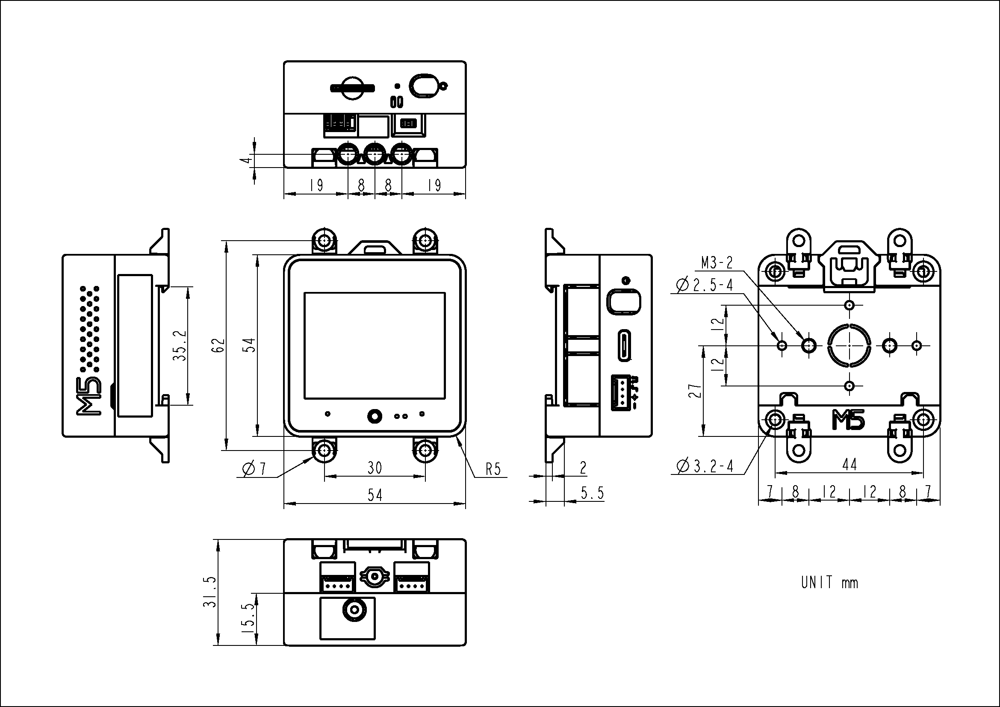
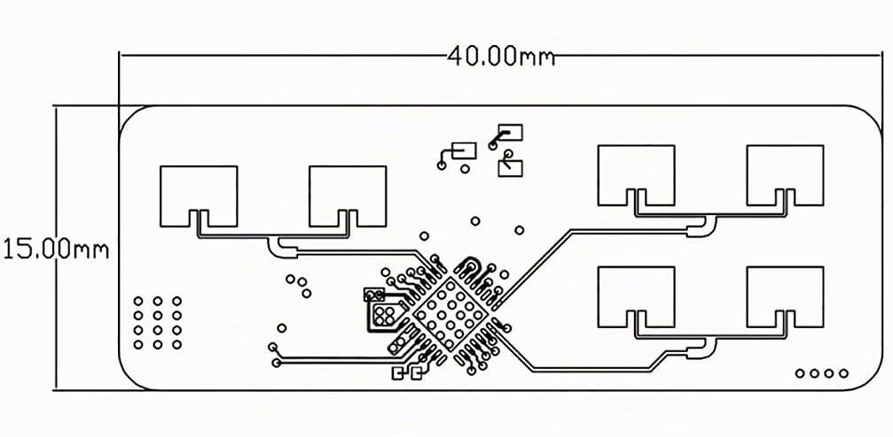

# CoreS3 + HLK-LD2450




Arduino が配布する macOS 用 `ctags` は Intel 用で Apple Silicon ではそのまま実行できないため。このプロジェクトでは Arduino 公式の同じ `5.8-arduino11` ソースを Nix で ARM 向けにビルドし、`$ARDUINO_CTAGS_PATH` にパスを設定して `--build-property` で指定  

`firmware/cores3_check/sketch.yaml` のプロファイルで、ボード用コアとM5Unified・M5GFX のバージョンを固定  
CoreS3 の Quad PSRAM は `PSRAM=enabled` を明示

## `justfile`
```sh
just                                  # コマンド一覧
just boards                           # 接続ポート一覧
just build                            # コンパイルのみ
just upload /dev/cu.usbmodem1101      # ビルドと通常の書き込み
```

- 書き込み先のポートは `just boards` で確認し、引数に指定
- どちらの書き込みコマンドも先にビルドを行い、成功した場合だけ書き込み
- 通常の開発では `just upload` を使う

以前の保存データもすべて消す必要があるときだけ `upload-erase`
```sh
just upload-erase /dev/cu.usbmodem1101
```

## Ref
- [M5Stack CoreS3 の Arduino 手順](https://docs.m5stack.com/en/arduino/m5cores3/program)
- [M5Stack ボード用パッケージ一覧](https://static-cdn.m5stack.com/resource/arduino/package_m5stack_index.json)
- [Arduino CLI ビルドプロファイル仕様](https://github.com/arduino/arduino-cli/blob/master/docs/sketch-project-file.md)
- [Arduino CLI 1.5.1 の FQBN 結合処理](https://github.com/arduino/arduino-cli/blob/v1.5.1/internal/cli/arguments/fqbn.go)
- [Arduino ctags の Apple Silicon 対応状況](https://github.com/arduino/ctags/issues/20)
- [M5Unified 0.2.23](https://github.com/m5stack/M5Unified/releases/tag/0.2.23)
- [M5GFX 0.2.30](https://github.com/m5stack/M5GFX/releases/tag/0.2.30)
- [just の設定仕様](https://just.systems/man/en/settings.html)
